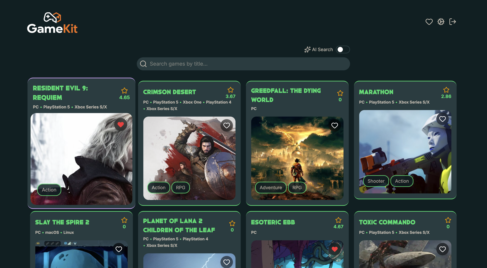
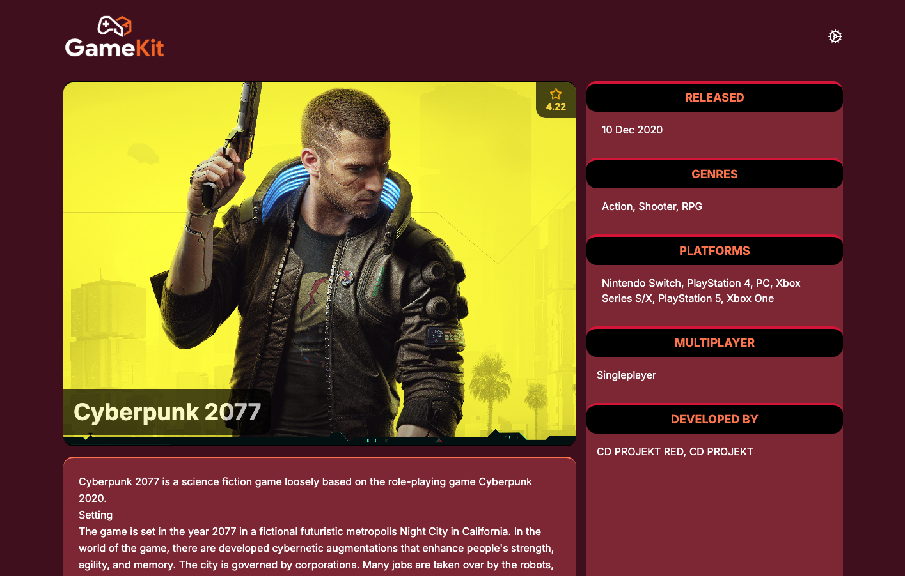
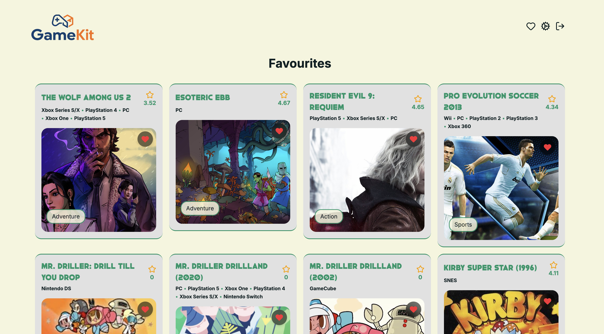

# GameKit

A full-stack **Game Discovery Platform** built with **React + TypeScript and Vercel serverless functions**, allowing users to browse, search, and discover games using the [RAWG Video Games Database API](https://rawg.io/apidocs), with authentication and user data stored in Supabase.

<a href="https://gamekit-7h67h9ioc-paologhidonis-projects.vercel.app/" target="_blank">🚀 Live Demo: GameKit</a>







## 🚀 Features

- 🎮 **Game Discovery** – Browse an extensive library of games from the RAWG API.
- 🔍 **Fuzzy Search** – Find games by name, search functionality to be expanded soon.
- ℹ️ **Detailed Game Information** – View game details including descriptions, ratings, screenshots, and trailers.
- 🔐 **Authentication & User Settings** – Account creation and Login via Supabase to access your personal settings.
- 💾 **User Data Storage** – Work in progress: Preferences and future favourites are stored securely in Supabase.
- 📱 **Responsive Design** – A seamless experience across desktop and mobile devices.
- 💅🏻 **Custom Themes** – Switch between light, dark and sunset modes.

## 🛠️ Tech Stack

### Backend:

- **Supabase** - Auth + Database.
- **Vercel** - Serverless Functions / full-stack app hosting.

### Frontend

- **Vite** – As the build tool for a faster and leaner development experience.
- **React + TypeScript** – For a strongly typed, component-based and scalable frontend.
- **RAWG API** – For sourcing comprehensive game data.
- **Tailwind CSS** – For utility-first styling and responsive layouts.
- **TanStack Query** For data fetching, caching and sync.
- **React Router** For client-side routing and navigation.
- **Lucide Icons** For sleek iconography.

### Deployment

The GitHub repository is connected to the Vercel project, which is deployed every time a push to `main` occurs.

## 📦 Installation

1.  Clone the repository:

    ```bash
    git clone https://github.com/paologhidoni/gamekit.git
    ```

2.  Navigate into the project directory and install dependencies:

    ```bash
    cd gamekit
    npm install
    ```

3.  Set up environment variables:

    The project uses **two separate `.env` files**:

    - **Frontend (`.env`)** – for Vite variables used in the client-side code:

      ```
      VITE_SUPABASE_URL=your_supabase_url_here
      VITE_SUPABASE_ANON_KEY=your_supabase_anon_key_here
      ```

    - **Backend (`.env.backend`)** – for server-side secrets used by Vercel serverless functions:

      ```
      SUPABASE_URL=your_supabase_url_here
      SUPABASE_SERVICE_ROLE_KEY=your_supabase_service_role_key_here
      RAWG_API_KEY=your_rawg_api_key_here
      ```

    ⚠️ Important: Make sure both `.env` and `.env.backend` are added to `.gitignore` to prevent secrets from being committed.

4.  Run the development server (both frontend and backend):

    ```bash
    npm run local
    ```

## 🎯 Project Goals

- [x] Build a responsive and interactive interface for game discovery.
- [x] Integrate with the RAWG API to fetch and display game data.
- [x] Implement robust search and filtering functionalities.
- [x] Deploy the application to GitHub Pages using GitHub Actions.

## 🔥 Future Enhancements

- [x] **User Authentication** – Allow users to create accounts, sign in and sign out.
- [ ] **Game Favourites** – Allow users to save favourite games in their account.
- [x] **Profile & Settings Pages** – More personalized user settings.
- [ ] **Advanced Filtering Options** – Add more granular filtering, such as by genre, platform, release date, popularity, ratings, developers, or publishers.
- [ ] **State Management Improvement** – Integrate a state management library like Zustand or Redux Toolkit for more complex state.
- [ ] **End-to-End Testing** – Add end-to-end tests using Playwright.

---

## 🚶🏻 Steps I followed to create this project

1. Initialise project with **React Typescript Template**:

   `npm create vite@latest gamekit --template react-ts`

2. Setup **React Router** in Data mode:

   `npm i react-router`

   [Docs](https://reactrouter.com/start/data/installation)

3. Setup **Tailwind**:

   `npm install tailwindcss @tailwindcss/vite`

   [Docs](https://tailwindcss.com/docs/installation/framework-guides/react-router)

4. Setup **TanStack Query**, formerly known as React Query:

   [Docs](https://tanstack.com/query/latest/docs/framework/react/overview)

5. Install **Lucide** for icons:

   `npm install lucide`

   [Docs](https://lucide.dev/guide/installation)
