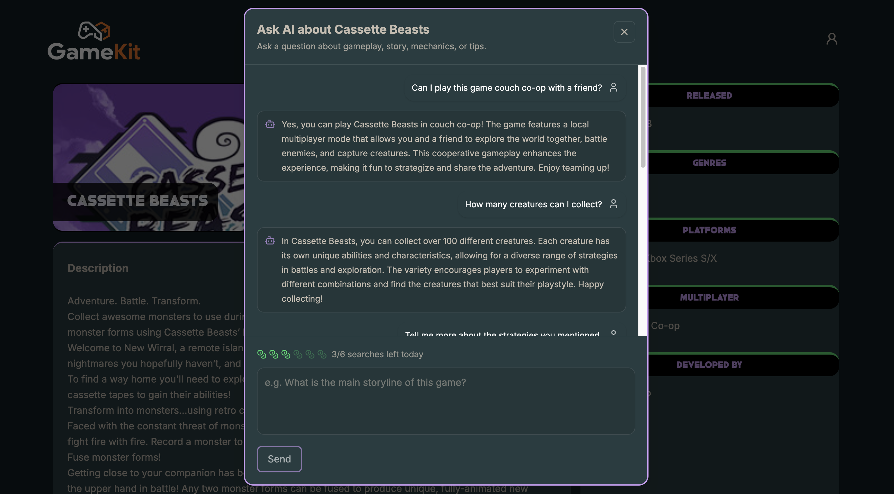
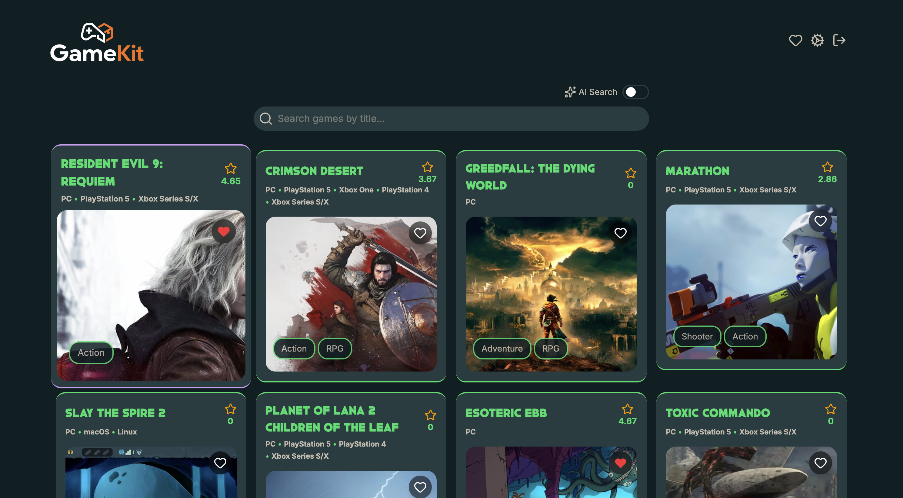
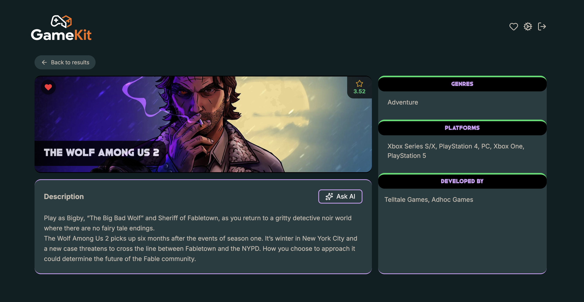
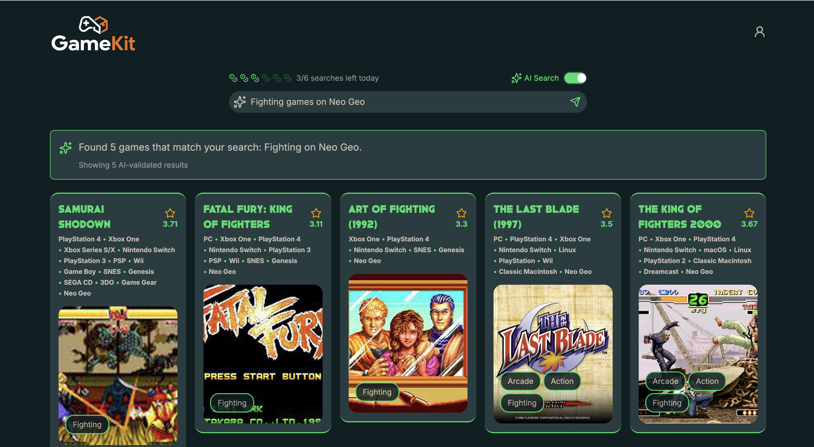
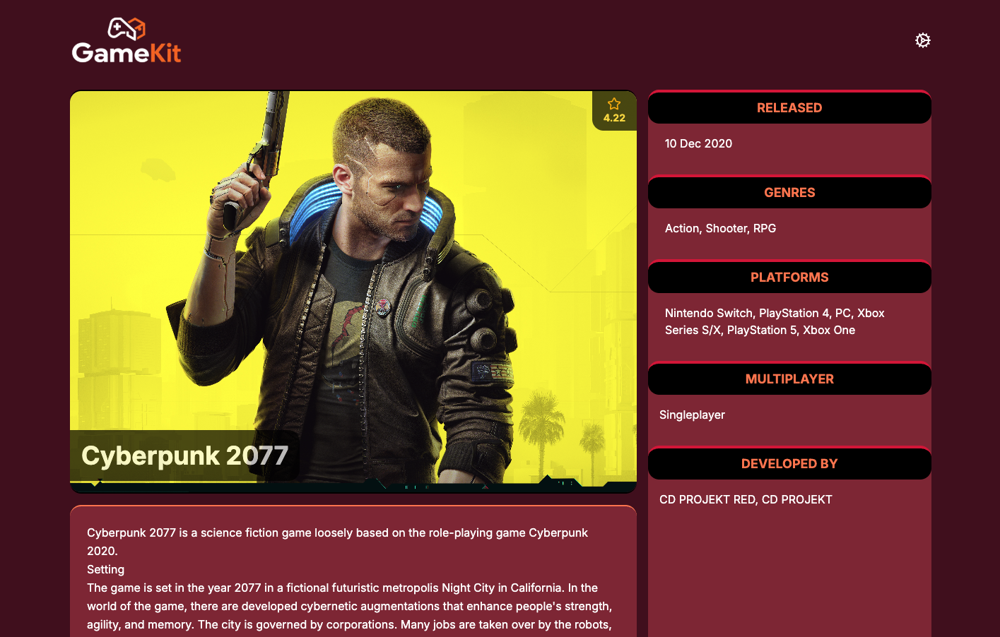
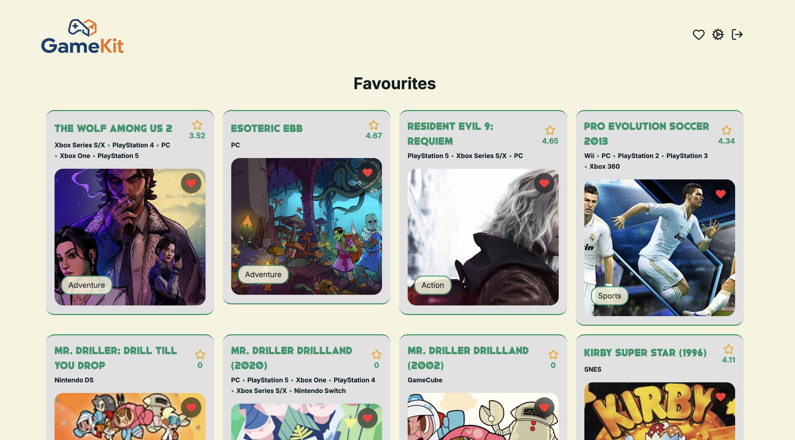

# GameKit

A full-stack **Game Discovery Platform** featuring an **AI chatbot** for each game's detail page and **AI-powered natural language search**, built with React + TypeScript, OpenAI GPT-4o-mini and Vercel serverless functions. Seamless integration with the [RAWG Video Games Database API](https://rawg.io/apidocs).

<a href="https://gamekit-six.vercel.app/" target="_blank">🚀 Live Demo: GameKit</a>

### Ask AI Chatbot (history + follow-ups)



### Home Page



### Game Detail Page



### AI Search



### Game Detail Page - Alternative Theme



### Favourites Page - Alternative Theme



## 🚀 Features

- ✨ **Ask AI Chatbot** – Multi-turn game Q&A modal with session history, follow-ups and a ChatGPT-style composer. Powered by OpenAI Responses API with chained turns.
- 🤖 **AI-Powered Search** – Natural-language queries like "cozy RPG games on Game Boy" interpreted by GPT-4o-mini, validated against RAWG with a custom hybrid scoring algorithm.
- 🎮 **Game Discovery** – Browse an extensive library of games from the RAWG API.
- 🔍 **Traditional Search** – Fast, debounced search by game title with real-time results.
- ℹ️ **Game Details** – Descriptions, ratings, screenshots and trailers for every game.
- 🔐 **Auth & Settings** – Supabase-based account creation, login and personal preferences.
- 📱 **Responsive Design** – Mobile-first layout across all pages.
- 💅🏻 **Custom Themes** – Light, dark and sunset modes.
- 💰 **Rate Limiting** – Upstash Redis (6 req/24h per IP); visual coin indicator shows remaining requests.
- 💾 **Session persistence** – Query cache and search workspaces survive refresh within the browser tab session; logout clears persisted data.
- ❤️ **Favourites** – Per-user list at `/favourites` with heart control on cards and detail; backed by Supabase RLS.

### Ask AI Chatbot Architecture

- **Chat UI & session history**: Message thread in a modal with scrollable area above a fixed composer; auto-scroll to latest message; accessible live region for new content.
- **Multi-turn context**: OpenAI **Responses API** with `store: true` and `previous_response_id`. Follow-ups stay in one conversation without the client storing full transcripts server-side.
- **Token-efficient prompting**: System instructions sent only on the first turn; continuations send the user message alone and rely on the stored chain.
- **Game-scoped behavior**: System prompt ties answers to the current game (similar-game recommendations, story, mechanics, tips) with clear refusal for off-topic non-gaming asks.
- **Strict wire contracts**: Zod schemas validate request bodies server-side and parse responses client-side with `safeParse`. Malformed data falls back to a safe message.
- **Serverless API**: `POST /api/ask-ai` keeps `OPENAI_API_KEY` server-side; rate limiting runs before the model call.

### AI-Powered Search Architecture

- **LLM-First Design**: GPT-4o-mini interprets natural language into structured search parameters via Function Calling with strict JSON schema enforcement.
- **Hybrid Validation**: AI suggestions scored against RAWG. AI confidence (40%) + Dice-coefficient name similarity (40%) + genre match (20%). Smart batching validates top 5 first, early-stops if ≥3 pass (40% fewer API calls).
- **Intelligent Fallback**: Falls back to structured RAWG search when AI validation yields <3 results.
- **Dynamic Platform/Genre Resolution**: Runtime caching maps platform/genre IDs from RAWG, preventing hardcoded mismatches.
- **Fuzzy Name Matching**: Custom normalizer strips edition suffixes ("HD", "Remastered") and calculates similarity with substring/year bonuses.
- **Controlled Vocabulary**: 50+ platforms prevents hallucination; graceful degradation for obscure platforms (WonderSwan, Neo Geo Pocket).

### Client persistence

- **TanStack cache → `sessionStorage`** (`gamekit_query_cache`): `PersistQueryClientProvider` + async storage persister; reload rehydrates the **entire** persisted query cache (classic search, game detail, favourites queries, etc.) within a 24h `maxAge`, aligned with default `gcTime`. AI search is the main **rate-limited** case that motivated persistence; classic list results rehydrate the same way.
- **Search workspaces → `sessionStorage`** (`gamekit_session_state:{guest|userId}`): `SearchContext` keeps `lastClassicQuery` / `lastAiQuery` in memory and syncs them to `sessionStorage` via `sessionDB`, so the **right `?q=`** is in the URL when you land on `/` or `/ai-search`; the page reads `q` from the URL and `useQuery` uses a **key derived from that `q`**—TanStack then serves **cached data for that key** if it exists, or fetches. TanStack never chooses your URL or your key for you; it only answers “do I already have this `queryKey`?”
- **AI search execution**: runs on explicit submit, or immediately if valid cached data already exists for the same key—cold loads with `?q=` alone do not consume quota.
- **Logout**: clears in-memory `QueryClient` and removes `gamekit_query_cache`; user-scoped session state keys are cleared on sign-out in `SearchContext`.

## 🛠️ Tech Stack

### Backend

- **Vercel Serverless Functions** – Scalable, stateless API endpoints
- **OpenAI SDK** (`openai`) – GPT-4o-mini integration for natural language processing
- **Upstash Redis** (`@upstash/redis`, `@upstash/ratelimit`) – Distributed rate limiting
- **Supabase** (`@supabase/supabase-js`) – Authentication + PostgreSQL database
- **RAWG API** – Comprehensive game database

### Shared

- **Zod** – Shared schemas in `src/schemas/` for inferred types and runtime validation on both serverless routes and the client

### Frontend

- **Vite** – Lightning-fast build tool with HMR
- **React + TypeScript** – Type-safe, component-based architecture
- **TanStack Query** (`@tanstack/react-query`, `@tanstack/react-query-persist-client`, `@tanstack/query-async-storage-persister`) – Server state, caching, and session-scoped cache persistence
- **React Router** (`react-router`) – Client-side routing with data loaders
- **Tailwind CSS** – Utility-first styling with custom theme system
- **Lucide React** (`lucide-react`) – Consistent iconography

### Deployment

The GitHub repository is connected to the Vercel project, which is deployed every time a push to `main` occurs.

## 📦 Installation

1.  Clone the repository:

    ```bash
    git clone https://github.com/paologhidoni/gamekit.git
    ```

2.  Navigate into the project directory and install dependencies:

    ```bash
    cd gamekit
    npm install
    ```

3.  Set up environment variables:

    The project uses **two separate `.env` files**:
    - **Frontend (`.env`)** – for Vite variables used in the client-side code:

      ```
      VITE_SUPABASE_URL=your_supabase_url_here
      VITE_SUPABASE_ANON_KEY=your_supabase_anon_key_here
      ```

    - **Backend (`.env.backend`)** – for server-side secrets used by Vercel serverless functions:

      ```
      SUPABASE_URL=your_supabase_url_here
      SUPABASE_SERVICE_ROLE_KEY=your_supabase_service_role_key_here
      RAWG_API_KEY=your_rawg_api_key_here
      OPENAI_API_KEY=your_openai_api_key_here
      UPSTASH_REDIS_REST_URL=your_upstash_redis_url_here
      UPSTASH_REDIS_REST_TOKEN=your_upstash_redis_token_here
      ```

    See `.env.example` and `.env.backend.example` for a complete templates.

    ⚠️ Important: Make sure both `.env` and `.env.backend` are added to `.gitignore` to prevent secrets from being committed.

4.  Run the development server (both frontend and backend):

    ```bash
    npm run local
    ```

## 🔥 Future Enhancements

- [ ] **Persist Ask AI history** – Save or restore chat across modal close / page reload (today history is per open session only)
- [ ] **Advanced Filtering** – Multi-criteria filtering (genre, platform, year, rating)
- [ ] **Recommendation Engine** – Collaborative filtering based on user preferences
- [ ] **End-to-End Testing** – Playwright test suite with CI/CD integration
- [ ] **Social sharing** – Share Game Details on Instagram, WhatsApp
- [ ] **Scroll to top** – Control for long pages (e.g. search results)

---

## 🚶🏻 Development Journey

### Frontend Foundation

1. **Initialize Vite + React + TypeScript**

   ```bash
   npm create vite@latest gamekit --template react-ts
   ```

2. **Setup React Router** (Data mode)

   ```bash
   npm i react-router
   ```

   [Docs](https://reactrouter.com/start/data/installation)

3. **Configure Tailwind CSS**

   ```bash
   npm install tailwindcss @tailwindcss/vite
   ```

   [Docs](https://tailwindcss.com/docs/installation/framework-guides/react-router)

4. **Add TanStack Query** for server state management

   ```bash
   npm i @tanstack/react-query @tanstack/react-query-persist-client @tanstack/query-async-storage-persister
   ```

   [Docs](https://tanstack.com/query/latest/docs/framework/react/overview) · [Persistence](https://tanstack.com/query/latest/docs/framework/react/plugins/persistQueryClient)

5. **Install Lucide React** for icons
   ```bash
   npm install lucide-react
   ```
   [Docs](https://lucide.dev/guide/installation)

### Backend & AI Integration

6. **Setup Supabase** for authentication and database

   ```bash
   npm install @supabase/supabase-js
   ```

7. **Integrate OpenAI SDK** for natural language processing

   ```bash
   npm install openai
   ```

8. **Add Upstash Redis** for distributed rate limiting

   ```bash
   npm install @upstash/redis @upstash/ratelimit
   ```

9. **Configure Vercel Serverless Functions** for backend API endpoints

10. **Add Zod** for type safety and runtime validation
    ```bash
    npm install zod
    ```
